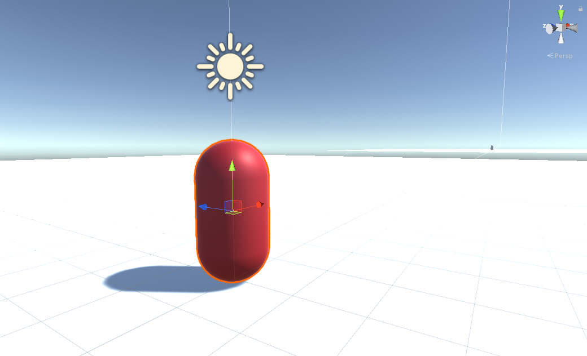

  

  <h1>The GDK for Unity Blank Project</h1>

  

    <strong>A blank starter project for the <a href="https://github.com/spatialos/gdk-for-unity">GDK for Unity.</a></strong>
  

  

    
    
    
  

  <h4>
    <a href="https://documentation.improbable.io/gdk-for-unity/docs/blank-project-tutorial-overview">Tutorial</a>
     | 
    <a href="https://github.com/spatialos/gdk-for-unity-blank-project/blob/master/CHANGELOG.md">Changelog</a>
  </h4>

# About

This is a blank project that you can use to as a base for your own game with the [SpatialOS GDK for Unity](https://github.com/spatialos/gdk-for-unity). It has the GDK boilerplate required to start developing games for SpatialOS:

- A Unity project already setup with the [SpatialOS GDK for Unity](https://github.com/spatialos/gdk-for-unity).
- Sample [deployment](https://documentation.improbable.io/gdk-for-unity/docs/gdk-glossary#section-deploying) configurations for local and cloud.
- [Client-worker and server-worker](https://documentation.improbable.io/gdk-for-unity/docs/gdk-glossary#section-worker) JSON [configuration files](https://documentation.improbable.io/spatialos-overview/docs/spl-worker-configuration-file).
- Client-worker and server-worker [connectors](https://documentation.improbable.io/gdk-for-unity/docs/worker-connectors) & worker prefabs.
- A set of Unity Scenes to use in development.
- [Build configuration](https://documentation.improbable.io/gdk-for-unity/docs/your-unity-project-2-build-your-workers) with sensible defaults.
- An empty [snapshot](https://documentation.improbable.io/gdk-for-unity/docs/snapshots) and stub code for generating new snapshots in the Unity Editor.

## Contributions

We are not currently accepting public contributions - see our [contributions](https://documentation.improbable.io/gdk-for-unity/docs/contribution-policy-on-github) policy. However, we are accepting issues and will gratefully appreciate your feedback.

---

* Your access to and use of the Unity Engine is governed by the Unity Engine End User License Agreement. Please ensure that you have agreed to those terms before you access or use the Unity Engine.

&copy; 2020 Improbable